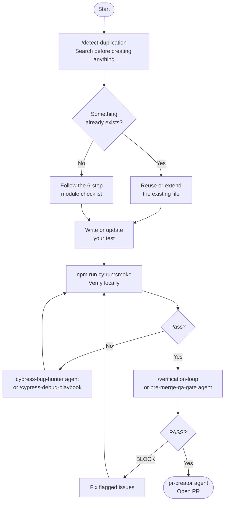

# Contributing

This project uses a strict **Config → Commands → Tests** architecture. Every contribution must follow it — the CI pipeline enforces it automatically.

---

## Before You Write Anything

```bash
# 1. Run duplication check — search for existing configs and commands first
/detect-duplication

# 2. Run the existing tests to confirm your baseline is clean
npm run cy:run:smoke
```

If `cy:run:smoke` fails before you touch anything, flag it to the team. Do not start a new contribution on a broken baseline.

---

## The Contribution Flow



---

## The 6-Step Module Checklist

When adding a genuinely new module (confirmed no existing match):

```text
[ ] 1. API Config    cypress/configs/api/modules/[x]/[x].api.js
[ ] 2. UI Config     cypress/configs/ui/modules/[x]/[x].ui.js
[ ] 3. Routes        cypress/configs/app/routes.js
[ ] 4. Commands      cypress/support/commands/modules/[x].commands.js
[ ] 5. Register      cypress/support/commands.js
[ ] 6. Spec          cypress/tests/[x]/smoke/[x]-smoke.cy.js
```

---

## Non-Negotiable Rules

The CI pipeline (`cypress-rules.yml`) blocks merge automatically on any of these:

```
NEVER  cy.wait(number)          — use cy.apiWait('@alias') or .should()
NEVER  hardcoded selectors      — use constants from cypress/configs/ui/**
NEVER  hardcoded URLs           — use constants from cypress/configs/app/routes.js
NEVER  *.actions.js files       — command-first only
NEVER  page-object wrappers     — commands own all logic
NEVER  real credentials in code — use cypress.env.json locally, secrets in CI
```

---

## Pre-Merge Checklist

```text
[ ] /detect-duplication run before creating any file
[ ] No hardcoded selectors — all from cypress/configs/ui/**
[ ] No hardcoded URLs — all from cypress/configs/app/routes.js
[ ] No cy.wait(number) — grep returns zero results
[ ] cy.ensureAuthenticated() in beforeEach() of all auth-required specs
[ ] New command registered in cypress/support/commands.js
[ ] npm run cy:run:smoke passes locally
[ ] /verification-loop returns PASS or PASS_WITH_ACTIONS
```

---

## Setting Up CI Secrets

If you are forking this boilerplate and setting up CI for the first time, add these to **Repository Settings → Secrets and variables → Actions** for each environment (`dev`, `qa`, `prod`):

| Secret | Value |
| ------ | ----- |
| `BASE_URL` | Your app URL |
| `CYPRESS_USERNAME` | Test user login |
| `CYPRESS_PASSWORD` | Test user password |
| `CYPRESS_AUTH_URL` | Auth endpoint path |

See [docs/ci-cd-guide.md](docs/ci-cd-guide.md) for full pipeline setup and AWS CodeBuild adaptation.

---

## Documentation

| What you need | Where |
| ------------- | ----- |
| First time setup | [docs/getting-started.md](docs/getting-started.md) |
| Joining an existing project | [docs/joining-an-existing-project.md](docs/joining-an-existing-project.md) |
| Architecture rules and why | [docs/framework-standards.md](docs/framework-standards.md) |
| Adding or updating modules | [docs/framework-maintenance-guide.md](docs/framework-maintenance-guide.md) |
| Writing commands | [docs/support-commands-instructions.md](docs/support-commands-instructions.md) |
| API intercepts | [docs/api-layer-guide.md](docs/api-layer-guide.md) |
| AI prompting | [docs/prompting-guide.md](docs/prompting-guide.md) |
| CI/CD pipeline | [docs/ci-cd-guide.md](docs/ci-cd-guide.md) |
