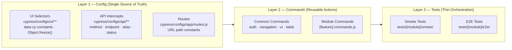
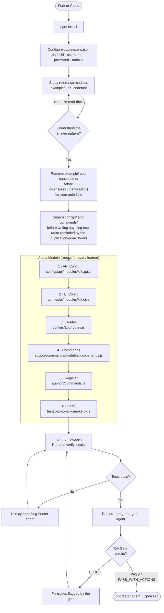
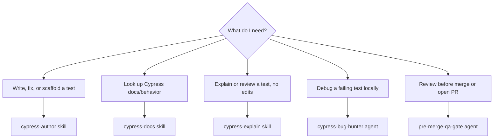

# Cypress Automation Boilerplate

> A production-ready, AI-assisted test automation framework any team can fork, adapt, and ship.
> Built on a **Config → Commands → Tests** architecture — framework-agnostic by design, Cypress by implementation.

---

## Contents

- [What is this?](#what-is-this)
- [The 3 Layers](#the-3-layers)
- [Full Workflow](#full-workflow)
- [Setup](#setup)
- [Add a Module](#add-a-module)
- [Run Tests](#run-tests)
- [AI Tools](#ai-tools)
- [Non-Negotiable Rules](#non-negotiable-rules)
- [Pre-Merge Checklist](#pre-merge-checklist)
- [Documentation](#documentation)

---

## What is this?

A Cypress framework boilerplate with a strict three-layer architecture, AI tooling (Claude Code + GitHub Copilot) wired in from day one, and a set of non-negotiable rules that prevent the most common test automation mistakes — hardcoded selectors, timing hacks, duplicated logic, and unmaintainable specs.

Fork it. Remove the example modules. Add your own. Ship.



---

## The 3 Layers

**Layer 1 — Config** is the single source of truth. Every selector, endpoint, and route lives here as a frozen constant. When your app changes, you update one file — not every test.

**Layer 2 — Commands** are the reusable building blocks. A `cy.loginAs('admin')` command is called from 50 tests. If login changes, you fix one command. Commands own all logic. Tests own none.

**Layer 3 — Tests** are thin orchestrations of `cy.*` calls only. A spec should read like plain English. If a test contains logic, that logic belongs in a command.

---

## Full Workflow

From fork to open PR — every decision point, every AI tool, in one diagram.



---

## Setup

**Prerequisites:** Node.js 18+, npm 9+, a running target app or staging URL.

### 1. Clone or fork

```bash
git clone <this-repo> my-project-automation
cd my-project-automation
npm install
```

### 2. Configure environment

```bash
cp cypress.env.example.json cypress.env.json
```

Edit `cypress.env.json` — set `baseUrl`, `username`, `password`, `authUrl`. This file is gitignored. Never commit it.

### 3. Verify setup with the included example

```bash
npm run cy:open
```

Run the `saucedemo/` smoke tests. If they pass, your setup is correct.

### 4. Adapt auth and remove examples

Edit `cypress/support/commands/common/auth.commands.js` — replace the example auth flow with your app's mechanism (Okta, OAuth, basic auth, session token).

Delete `cypress/tests/example/` and `cypress/tests/saucedemo/` once you have studied the pattern.

> Full walkthrough: [docs/onboarding/getting-started.md](docs/onboarding/getting-started.md)

---

## Add a Module

Search `cypress/configs/` and `cypress/support/commands/` first — before creating anything new. (The duplication-guard prompt hook reminds you automatically.)

| Step | What to create        | Path                                               |
| ---- | --------------------- | -------------------------------------------------- |
| 1    | API intercept config  | `cypress/configs/api/modules/[x]/[x].api.js`       |
| 2    | UI selector config    | `cypress/configs/ui/modules/[x]/[x].ui.js`         |
| 3    | Register routes       | `cypress/configs/app/routes.js`                    |
| 4    | Module commands       | `cypress/support/commands/modules/[x].commands.js` |
| 5    | Register command file | `cypress/support/commands.js`                      |
| 6    | Write spec            | `cypress/tests/[x]/smoke/[x]-smoke.cy.js`          |

**Every API config entry follows this exact shape:**

```javascript
import { HTTP_STATUS } from "@core/api/status-codes.js";

export const PAYMENTS_API = Object.freeze({
  LIST: Object.freeze({
    method: "GET",
    endpoint: "**/api/payments**",
    alias: "paymentsList",
    expectedStatus: HTTP_STATUS.OK,
  }),
});
```

> Full guide: [docs/guides/framework-maintenance-guide.md](docs/guides/framework-maintenance-guide.md)

---

## Run Tests

| What                   | Command                                         |
| ---------------------- | ----------------------------------------------- |
| Interactive runner     | `npm run cy:open`                               |
| All tests headless     | `npm run cy:run`                                |
| Smoke suite only       | `npm run cy:run:smoke`                          |
| Filter by tag          | `npm run cy:run:tag -- --env grepTags=@tagname` |
| Against a specific env | `npm run cy:run -- --env configFile=qa`         |

---

## AI Tools

Skills are the primary entry point — reach for one first. Agents handle multi-step reasoning tasks (review, debugging, audits, workflow gates) that a single skill invocation doesn't cover.



### Skills — primary

| Skill             | When to use                                                              |
| ----------------- | ------------------------------------------------------------------------ |
| `cypress-author`  | Create, update, or fix a test (E2E/component), or scaffold a full module |
| `cypress-docs`    | Look up verified Cypress API/config/behavior from official docs          |
| `cypress-explain` | Explain or review an existing test without making edits                  |

### Agents — multi-step / workflow gates

| Agent                | When to use                                                                   |
| -------------------- | ----------------------------------------------------------------------------- |
| `cypress-bug-hunter` | Debugging a failing test locally                                              |
| `pre-merge-qa-gate`  | Code review + full 6-phase QA gate — PASS / PASS_WITH_ACTIONS / BLOCK verdict |
| `pr-creator`         | Opening a pull request with a generated description                           |

---

## Non-Negotiable Rules

```
NEVER  →  cy.wait(number)              Masks timing bugs. Use cy.apiWait() or .should()
NEVER  →  hardcoded selectors          Use constants from cypress/configs/ui/**
NEVER  →  hardcoded URLs or routes     Use constants from cypress/configs/app/routes.js
NEVER  →  *.actions.js files           Command-first only — no action file wrappers
NEVER  →  page-object wrappers         Commands own all logic — no POM layer
NEVER  →  real credentials in code     Use cypress.env.json locally, env vars in CI
NEVER  →  new file without searching   Search cypress/configs/ and cypress/support/commands/ first

ALWAYS →  cy.ensureAuthenticated()     In beforeEach() for every auth-required spec
ALWAYS →  config constants             Check cypress/configs/ before adding any selector
ALWAYS →  one command = one owner      Verify the name is unique in commands.js
ALWAYS →  data-cy attributes           For all new selectors you add to the app
ALWAYS →  apiIntercept before visit    Register intercepts before cy.visit() fires
```

> Full rationale: [docs/reference/framework-standards.md](docs/reference/framework-standards.md)

---

## Pre-Merge Checklist

```
[ ] No hardcoded selectors — all constants from cypress/configs/ui/**
[ ] No hardcoded URLs — all constants from cypress/configs/app/routes.js
[ ] No new *.actions.js or page-object files
[ ] No cy.wait(number) — grep -r "cy\.wait([0-9]" cypress/ returns zero results
[ ] cy.ensureAuthenticated() in beforeEach() of all auth-required specs
[ ] New command registered in cypress/support/commands.js
[ ] Lint passes — npm run lint
[ ] If this is a bug fix — regression test named [BUG-NNN] is present
[ ] pre-merge-qa-gate agent returns PASS or PASS_WITH_ACTIONS
```

---

## Documentation

| Doc                                                                                              | What it covers                                                                   |
| ------------------------------------------------------------------------------------------------ | -------------------------------------------------------------------------------- |
| [docs/onboarding/getting-started.md](docs/onboarding/getting-started.md)                         | Step-by-step onboarding — setup, first test, environment config                  |
| [docs/onboarding/joining-an-existing-project.md](docs/onboarding/joining-an-existing-project.md) | Joining a team that already uses this framework mid-project                      |
| [docs/reference/framework-standards.md](docs/reference/framework-standards.md)                   | Architecture rules, naming conventions, selector strategy                        |
| [docs/reference/test-organization.md](docs/reference/test-organization.md)                       | Why configs/tests/commands are split this way — principles behind every decision |
| [docs/reference/api-layer-guide.md](docs/reference/api-layer-guide.md)                           | API engine, intercepts, aliasing, schema validation                              |
| [docs/guides/framework-maintenance-guide.md](docs/guides/framework-maintenance-guide.md)         | Adding modules, updating configs, evolving the framework                         |
| [docs/guides/support-commands-instructions.md](docs/guides/support-commands-instructions.md)     | Command authoring guide — patterns, ownership, registration                      |
| [CONTRIBUTING.md](CONTRIBUTING.md)                                                               | Contribution flow, pre-merge checklist, CI secrets setup                         |
