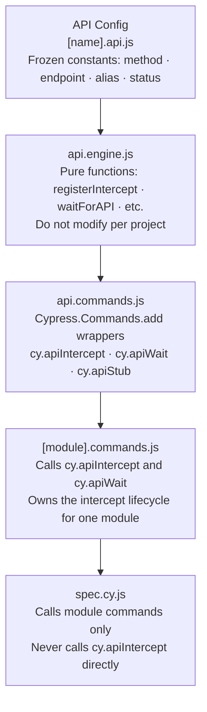

# API Layer Guide

> **This is a reference + how-to doc.** It explains the API engine, documents every command, and shows how to use each one correctly. Use it when writing or debugging anything that touches network intercepts.

---

## How the API Layer Works



**The spec never calls `cy.apiIntercept` directly.** It calls a module command (e.g. `cy.visitPayments()`), which owns the intercept setup internally. This keeps specs clean and ensures intercepts are always registered in the right order.

---

## The Critical Rule: Intercept Before Visit

Intercepts must be registered **before** the page visit that triggers the request. Network requests fire the moment the browser navigates. If you register an intercept after `cy.visit()`, the request has already passed.

```javascript
// Correct — intercept registered before the page loads
beforeEach(() => {
  cy.apiIntercept(PAYMENTS_API, "LIST");
  cy.visit("/payments");
  cy.apiWait("@paymentsList");
});

// Wrong — the LIST request fires on page load, before the intercept is registered
beforeEach(() => {
  cy.visit("/payments");
  cy.apiIntercept(PAYMENTS_API, "LIST"); // too late
});
```

---

## API Config Shape

Every API config entry is a frozen object with four required fields:

```javascript
import { HTTP_STATUS } from "@support/core/api/status-codes.js";

export const PAYMENTS_API = Object.freeze({
  LIST: Object.freeze({
    method: "GET",           // HTTP method
    endpoint: "**/api/payments**",  // glob pattern — ** matches any path segment
    alias: "paymentsList",   // unique camelCase — used as @paymentsList in cy.apiWait
    expectedStatus: HTTP_STATUS.OK, // validated on wait
  }),
  CREATE: Object.freeze({
    method: "POST",
    endpoint: "**/api/payments**",
    alias: "paymentsCreate",
    expectedStatus: HTTP_STATUS.CREATED,
  }),
});
```

**Alias naming convention:** `[module][Action]` in camelCase — `paymentsList`, `paymentsCreate`, `paymentsVoid`. Must be unique across all API configs.

**Endpoint patterns:** Use `**` as a wildcard for any path segment. `**/api/payments**` matches `https://app.com/api/payments`, `https://api.app.com/v2/api/payments`, etc.

---

## Command Reference

### `cy.apiIntercept(config, key)`

Registers a single intercept before a page visit.

```javascript
cy.apiIntercept(PAYMENTS_API, "LIST");
cy.visit("/payments");
cy.apiWait("@paymentsList");
```

Use this when you need fine-grained control over which intercepts are active.

---

### `cy.apiWait(alias)`

Waits for a registered intercept to complete. Returns the interception object.

```javascript
cy.apiWait("@paymentsList");

// With response inspection
cy.apiWait("@paymentsList").then(({ response }) => {
  expect(response.statusCode).to.eq(200);
  expect(response.body.items).to.have.length.above(0);
});
```

`cy.apiWait()` replaces `cy.wait(number)` — it waits for the actual network response, not a guessed duration.

---

### `cy.apiWaitAll(aliases)`

Waits for multiple intercepts simultaneously. Use when a page load triggers several parallel requests.

```javascript
cy.apiWaitAll(["@paymentsList", "@userProfile", "@notificationCount"]);
```

---

### `cy.apiStub(config, key, response)`

Returns a mocked response instead of hitting the real server. Use for testing edge cases (empty state, error states, large datasets) without needing the backend to produce them.

```javascript
// Test empty state
cy.apiStub(PAYMENTS_API, "LIST", {
  body: { items: [], total: 0 },
  statusCode: 200,
});

// Test server error
cy.apiStub(PAYMENTS_API, "LIST", {
  statusCode: 500,
  body: { error: "Internal Server Error" },
});
```

---

### `cy.apiRequest(options)`

Makes a direct HTTP request. Use for test setup and teardown — creating seed data, cleaning up records — not for testing UI flows.

```javascript
// Create a payment record before the test
cy.apiRequest({
  method: "POST",
  url: "/api/payments",
  body: { amount: 100, currency: "USD" },
  headers: { Authorization: `Bearer ${Cypress.env("apiToken")}` },
});
```

---

## Response Schema Validation

Validate that API responses match the expected shape using `cy.validateSchema()`.

Create a schema file at `cypress/schemas/[name].schema.js`:

```javascript
export const PAYMENTS_SCHEMAS = {
  LIST: {
    type: "object",
    required: ["items", "total"],
    properties: {
      items: { type: "array" },
      total: { type: "number" },
    },
  },
};
```

Use it in a test:

```javascript
import { PAYMENTS_SCHEMAS } from "@schemas/payments.schema";

cy.apiWait("@paymentsList").then(({ response }) => {
  cy.validateSchema(response.body, PAYMENTS_SCHEMAS.LIST);
});
```

Schema validation catches API contract breaks early — before they silently corrupt test data or produce misleading UI assertions.

---

## Common Mistakes

| Mistake | What happens | Fix |
| ------- | ------------ | --- |
| `cy.visit()` before `cy.apiIntercept()` | Intercept never fires, `cy.apiWait()` times out | Register intercept first, always |
| Duplicate alias across modules | Second intercept silently overrides the first | Keep aliases unique — check all API configs before adding |
| Using `cy.wait(2000)` instead of `cy.apiWait()` | Test is timing-dependent, fails on slow CI | Always use `cy.apiWait('@alias')` |
| Calling `cy.apiIntercept()` directly in a spec | Ownership leak — specs should not know about intercepts | Move to the module's `intercept*` command |
| Glob pattern too broad (e.g. `**`) | Intercept matches unintended requests | Use specific patterns: `**/api/payments**` |

---

## Path Aliases

The framework ships with three path aliases for clean imports:

| Alias | Resolves to |
| ----- | ----------- |
| `@configs` | `cypress/configs/` |
| `@support` | `cypress/support/` |
| `@fixtures` | `cypress/fixtures/` |

```javascript
import { PAYMENTS_API } from "@configs/api/modules/payments/payments.api";
import { HTTP_STATUS } from "@support/core/api/status-codes.js";
import paymentData from "@fixtures/payments.json";
```
