# Building an AI-Powered Cypress Automation Framework — Architecture, Evolution, and Engineering Decisions

> How a fragmented, hard-to-scale test suite was rebuilt from the ground up — through deliberate architecture choices, structured AI configuration, and an engineering approach designed to grow with the product.

---

## Table of Contents

1. [Why This Article](#1-why-this-article)
2. [The Starting Point — What Wasn't Working](#2-the-starting-point--what-wasnt-working)
3. [The Decision Matrix — Choosing Our Architecture](#3-the-decision-matrix--choosing-our-architecture)
4. [Config → Commands → Tests — The Pattern That Changed Everything](#4-config--commands--tests--the-pattern-that-changed-everything)
5. [Teaching AI to Follow Your Rules](#5-teaching-ai-to-follow-your-rules)
6. [The Copilot Customization Ecosystem](#6-the-copilot-customization-ecosystem)
7. [MCP Integrations — Connecting AI to Your Entire Workflow](#7-mcp-integrations--connecting-ai-to-your-entire-workflow)
8. [How We Use AI Daily — Real Workflows](#8-how-we-use-ai-daily--real-workflows)
9. [Prompting Techniques That Actually Work](#9-prompting-techniques-that-actually-work)
10. [Impact — What Changed After AI Integration](#10-impact--what-changed-after-ai-integration)
11. [Patterns That Scale](#11-patterns-that-scale)
12. [Lessons Learned — The Hard Way](#12-lessons-learned--the-hard-way)
13. [Getting Started — For Teams Who Want to Try This](#13-getting-started--for-teams-who-want-to-try-this)

---

## 1. Why This Article

This isn't a tutorial. It's a technical deep-dive into how a Cypress automation framework was architected, configured, and evolved — covering the decisions made, the patterns adopted, the trade-offs considered, and how AI was integrated not as a shortcut, but as a first-class part of the engineering workflow.

The foundation was built with one driving principle: **patterns should be enforced by the system, not remembered by individuals.** Selectors belong in one place. Behavior belongs in one place. AI should generate code that fits the architecture, not fight it. Tests should read like business requirements, not implementation guides.

This article walks through:

- The architectural evaluation process and the decision matrix that drove the final approach
- The Config → Commands → Tests pattern and why it outperforms the alternatives
- How GitHub Copilot was configured to understand and enforce the framework's rules
- How MCP integrations connected AI to the full delivery workflow — from Jira tickets to pull requests
- The impact of these decisions on consistency, velocity, and team scalability

---

## 2. The Starting Point — What Wasn't Working

The codebase had grown organically over time. Tests were written in whatever pattern was convenient at the moment — no enforced architecture, no shared conventions, no documentation. Multiple contributors had added code across different files, each making locally reasonable decisions that created a globally inconsistent system.

The real problem wasn't inconsistency. It was **the absence of a framework that could enforce consistency going forward.** Without one, every new test was a fresh opportunity for patterns to diverge further.

### The Patterns That Coexisted

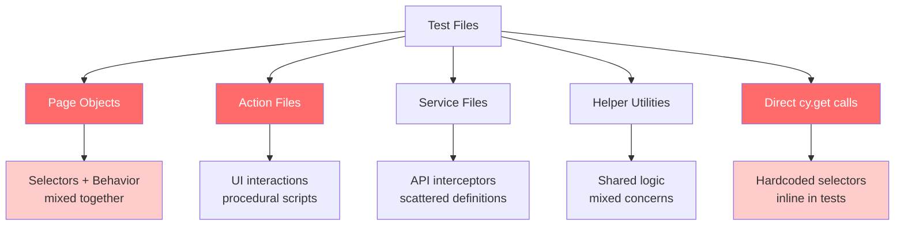

Three different architectural patterns were used across the same codebase:

| Pattern                    | How It Was Used                                           | The Problem                                                         |
| -------------------------- | --------------------------------------------------------- | ------------------------------------------------------------------- |
| **Page Objects**           | Classes wrapping selectors + methods                      | Selectors and behavior tightly coupled; hard for AI to reason about |
| **Action + Service pairs** | Separate files for UI actions and API services per module | Duplicated logic across pairs; no single source of truth            |
| **Inline everything**      | Hardcoded selectors and waits directly in test files      | Zero reusability; every new test reinvented the wheel               |

### What This Looked Like In Practice

A single domain module (e.g., a dashboard feature) typically had:

- A **Page Object** with selectors and methods
- An **Actions file** with UI interaction sequences
- A **Services file** with API intercept definitions
- A **Test file** importing all three

When the UI changed a selector, you'd update the page object — but the action file might have its own copy. When an API endpoint path changed, you'd fix the service file — but some tests had it hardcoded. **Dual ownership meant things drifted silently.**

### The AI Problem

Enabling GitHub Copilot without configuring it made things worse. Copilot generated:

- **Page object classes** — the most common Cypress pattern in its training data
- **Hardcoded selectors** like `cy.get('.btn-primary')` instead of the config-driven approach
- **Arbitrary waits** like `cy.wait(3000)` — exactly the anti-pattern the architecture was designed to eliminate
- **New action files** for logic that already existed as custom commands

**Copilot was producing code that looked correct but violated every architectural decision already in place.** It was generating the internet's median Cypress pattern — not the one engineered for this codebase.

Without AI that understood the architecture, every suggestion became a liability: something to review, correct, and undo rather than trust. The framework needed AI that _reinforced_ its patterns, not one that pulled in the opposite direction.

---

## 3. The Decision Matrix — Choosing Our Architecture

We evaluated three architectural approaches before committing:

### Architecture Comparison

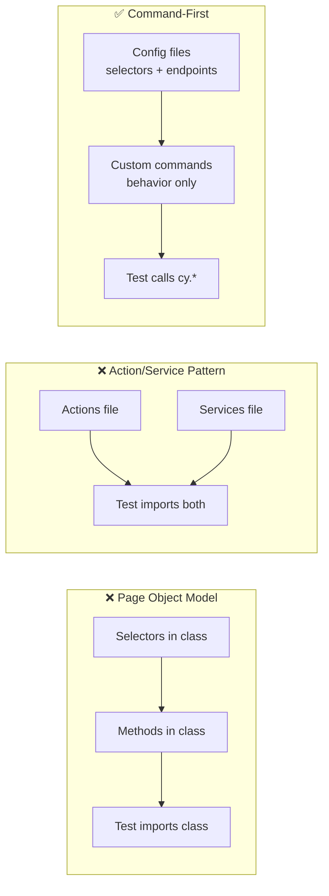

| Criteria                             |           Page Objects           |         Action/Service          |             **Command-First**              |
| ------------------------------------ | :------------------------------: | :-----------------------------: | :----------------------------------------: |
| Single source of truth for selectors |      ❌ Mixed with behavior      |          ⚠️ Scattered           |            ✅ Config files only            |
| Single source of truth for behavior  |    ❌ Split across PO + tests    | ❌ Split across actions + tests |              ✅ Commands only              |
| AI can learn the pattern             | ❌ Class hierarchies are complex |     ⚠️ Too many file types      |     ✅ Simple: config → command → test     |
| New module scaffolding speed         |        Slow (many files)         |      Medium (paired files)      | **Fast (3 config files + 1 command file)** |
| Refactoring safety                   |   ❌ Change ripples everywhere   |    ⚠️ Pair must stay in sync    |       ✅ Each file owns one concern        |
| Onboarding new team members          |       Steep learning curve       |             Medium              |    **Low — just learn cy.\* commands**     |

### The Decision

We chose **Config → Custom Commands → Tests** because:

1. **Separation of concerns is absolute** — selectors live in configs, behavior lives in commands, tests orchestrate intent
2. **AI can reason about it** — given a config file and a command file, AI generates the right pattern every time
3. **Tests become thin** — a test file reads like a user story, not an implementation guide
4. **Single ownership** — every selector has one home, every behavior has one owner

---

## 4. Config → Commands → Tests — The Pattern That Changed Everything

### The Architecture Visualized

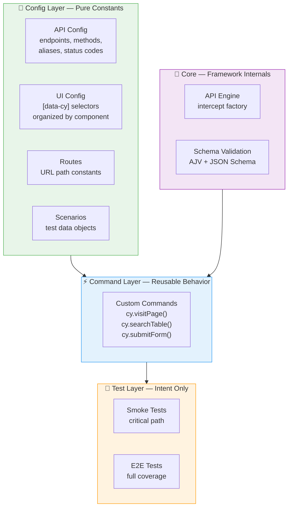

### The 7 Non-Negotiable Rules

These rules aren't suggestions — they're enforced by both humans and AI:

|  #  | Rule                                             | Why It Matters                                                       |
| :-: | ------------------------------------------------ | -------------------------------------------------------------------- |
|  1  | **No page objects, no action files**             | Dual ownership causes silent drift between abstractions              |
|  2  | **No `cy.wait(milliseconds)`**                   | Use `cy.apiWait('@alias')` or `.should()` — deterministic waits only |
|  3  | **`[data-cy="..."]` selectors only**             | Decoupled from CSS; survives UI refactors                            |
|  4  | **Auth via `cy.ensureAuthenticated()` only**     | Ensures `cy.session()` caching across specs                          |
|  5  | **Intercepts registered BEFORE `cy.visit()`**    | Requests fire before Cypress registers listeners otherwise           |
|  6  | **State reset in `beforeEach`, not `afterEach`** | `afterEach` doesn't run on test failure                              |
|  7  | **All URL paths from `ROUTES` constants**        | Never hardcode a URL in a test or command                            |

### What a Module Looks Like

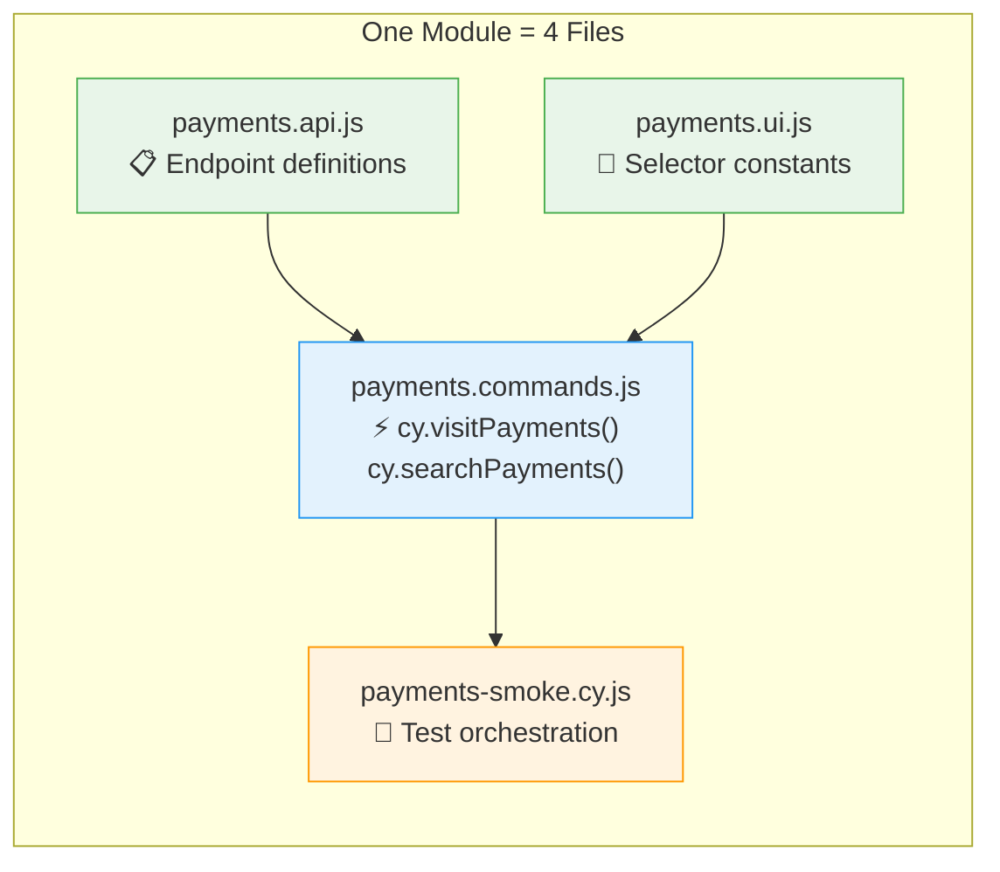

**Config** files are pure constants — frozen objects with endpoint definitions, selector strings, and route paths. They import nothing from the framework.

**Command** files are verb-first Cypress commands (`visitPayments`, `searchPayments`, `assertTableHasRows`). They import from configs and produce reusable `cy.*` methods.

**Test** files are thin orchestration — they call `cy.*` commands and make assertions. No direct DOM manipulation, no hardcoded values.

```js
// What a test ACTUALLY looks like
describe("Payments Dashboard", { tags: ["@payments"] }, () => {
  before(() => cy.ensureAuthenticated());
  beforeEach(() => cy.visitPayments());

  it("searches and filters payments", { tags: ["@smoke"] }, () => {
    cy.searchPayments("test-account");
    cy.assertTableHasRows('[data-cy="payments-table"]', 1);
  });
});
```

Anyone can read this and understand the business intent — without knowing how authentication, page loading, or search internals work.

---

## 5. Teaching AI to Follow Your Rules

This is the insight that changed everything for us: **AI generates whatever pattern is most common in its training data.** For Cypress, that's page objects with hardcoded selectors. If you want AI to follow YOUR patterns, you have to **explicitly teach it your rules.**

### The Before and After

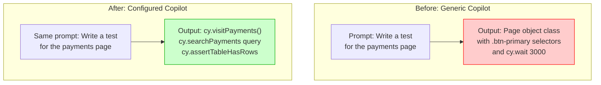

The difference isn't in the prompt — it's in the **configuration files** that Copilot reads before generating anything.

### The Configuration Stack

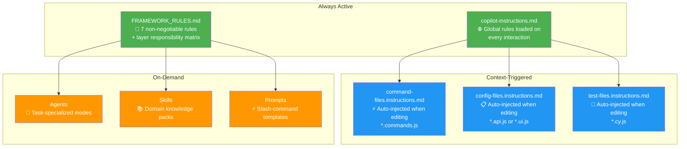

### What the Global Instructions Tell AI

The `copilot-instructions.md` file is loaded into **every** Copilot interaction. Ours contains:

- **Architecture mandate**: Config → Commands → Tests. No exceptions.
- **Prohibited patterns**: No page objects, no action files, no hardcoded selectors, no `cy.wait(ms)`
- **Context loading**: Before generating code, read the routes file, UI selector configs, and API configs
- **Documentation references**: Pointer to canonical docs for architecture rules, API patterns, and support command authoring

This single file eliminated 80% of the "AI generating wrong patterns" problem overnight.

---

## 6. The Copilot Customization Ecosystem

We invested heavily in customization files — and the ROI has been extraordinary. Here's the full ecosystem:

### The Customization Map

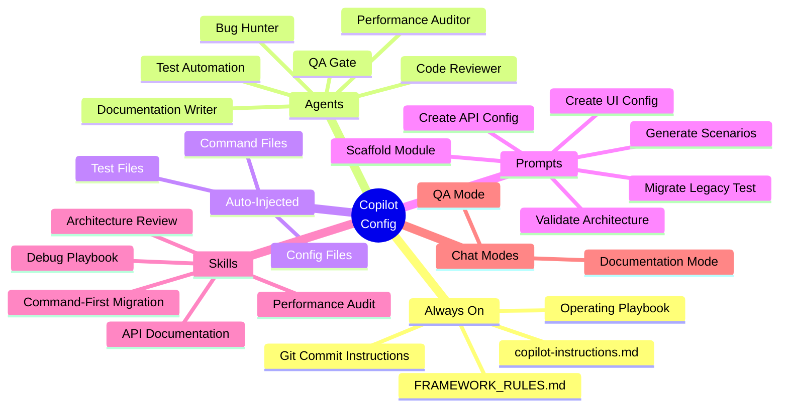

### Agents — Task Specialization

Each agent is a markdown file with YAML frontmatter that defines a specialized AI mode:

| Agent                    | When to Use                   | What It Does                                                |
| ------------------------ | ----------------------------- | ----------------------------------------------------------- |
| **Test Automation**      | Writing new tests or commands | Generates code following command-first patterns             |
| **Code Reviewer**        | Before merging a PR           | Checks architecture compliance, finds anti-patterns         |
| **Bug Hunter**           | Test failure in CI            | Structured root cause analysis: Test → Command → Config     |
| **Performance Auditor**  | Slow or flaky tests           | Analyzes `cy.session()` usage, deduplication, wait patterns |
| **Documentation Writer** | Updating framework docs       | Cross-references actual codebase for accuracy               |
| **QA Gate**              | Pre-release quality check     | Architecture + bugs + performance in one pass               |

The **Bug Hunter** is particularly powerful. It follows a structured debug sequence:

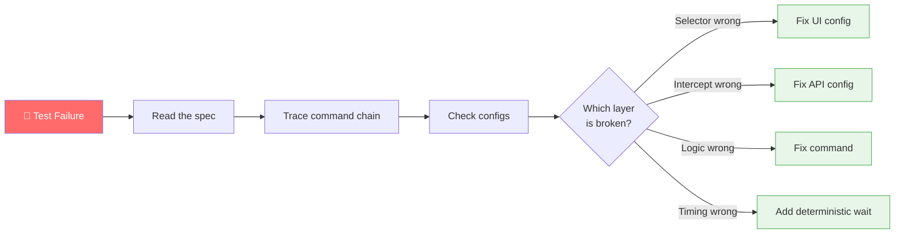

### Auto-Injected Instructions — The Silent Enforcers

These files are **automatically loaded** based on what file you're editing:

| Editing...              | Instructions Loaded | Key Rules                                                              |
| ----------------------- | ------------------- | ---------------------------------------------------------------------- |
| `*.commands.js`         | Command file rules  | Use `Cypress.Commands.add()`, import from configs, verb-first naming   |
| `*.api.js` or `*.ui.js` | Config file rules   | Use `Object.freeze()`, UPPER_SNAKE_CASE keys, include `expectedStatus` |
| `*.cy.js`               | Test file rules     | Call `cy.*` commands only, no direct DOM manipulation, use grep tags   |

You don't invoke these. You don't remember them. They just work — every time a developer opens a file, Copilot already knows the rules for that file type.

### Skills — Packaged Domain Knowledge

Skills go deeper than instructions. A skill is a `SKILL.md` file containing tested workflows for specific domains:

| Skill                       | What It Encodes                                                      |
| --------------------------- | -------------------------------------------------------------------- |
| **Architecture Review**     | How to evaluate changes for command-first compliance                 |
| **Command-First Migration** | Step-by-step process for converting legacy patterns                  |
| **Debug Playbook**          | Structured methodology: reproduce → trace → identify layer → fix     |
| **Performance Audit**       | Checklist for session caching, wait patterns, fixture sizes          |
| **API Documentation**       | Consistent format for endpoint docs (schema, status codes, examples) |

**Why skills beat prompts for complex tasks**: A prompt is a one-shot template. A skill is a persistent knowledge package that shapes how AI **thinks** about a problem domain. When the migration skill is loaded, AI doesn't just "convert the file" — it follows our specific sequence, checks backward compatibility, preserves import paths, and validates output.

---

## 7. MCP Integrations — Connecting AI to Your Entire Workflow

GitHub Copilot's capability doesn't stop at code generation. Through **Model Context Protocol (MCP)**, we connected Copilot directly to the tools our team relies on daily — and the result was a seamless loop from **ticket creation to code merge, without ever leaving VS Code**.

MCP is a protocol that allows AI assistants to communicate with external services. Think of it as giving Copilot hands — it can read from and write to Jira, create branches, commit code, open pull requests, and more, all in response to natural language.

### The Two MCP Servers We Integrated

We integrated two MCP servers that cover the full development lifecycle:

| MCP Server        | Service      | What It Controls                                                |
| ----------------- | ------------ | --------------------------------------------------------------- |
| **Atlassian MCP** | Jira         | Tickets, bugs, status updates, descriptions, comments, worklogs |
| **GitKraken MCP** | GitHub / Git | Branches, commits, pull requests, code reviews, git status      |

### Jira — From Conversation to Ticket

Before MCP, moving a bug report from a failing test to a Jira ticket required switching context: copy the error, open Jira, create a ticket, fill fields, assign. Each step was manual.

With the Atlassian MCP, Copilot can do all of this in one prompt:

```
@cypress-bug-hunter The smoke test for payments dashboard is failing —
intercept for @PAYMENT_LIST is not being caught. Create a Jira bug ticket
in the SERV project with steps to reproduce.
```

Copilot diagnoses the issue, formats the description, and creates the ticket — complete with steps to reproduce, the affected component, and the suggested fix.

**What we use Jira MCP for:**

| Operation                           | How We Trigger It                                                |
| ----------------------------------- | ---------------------------------------------------------------- |
| Create bug ticket from test failure | `"Create a Jira bug for this failure: [error]"`                  |
| Update ticket status                | `"Mark SERV-1234 as In Progress"`                                |
| Add a comment to a ticket           | `"Add a comment to SERV-1234: intercept fixed, awaiting review"` |
| Log work                            | `"Log 2 hours on SERV-1234 for fixing the intercept issue"`      |
| Update description with findings    | `"Update SERV-1234 description with the root cause I found"`     |
| Link related tickets                | `"Link SERV-1234 as a blocker for SERV-1235"`                    |

The key win: **our test failures become Jira tickets automatically, with full context, without anyone manually writing them up.**

### GitHub — From Code to PR Without Leaving the Editor

The GitKraken MCP server gives Copilot full control over the Git workflow. Combined with our command-first architecture, the loop from "generate code" to "open PR" became a single conversation:

```
"Create a branch called feature/payments-smoke-test, commit the new
command file and spec, and open a PR targeting main with a description
of what the test covers."
```

**What we use Git MCP for:**

| Operation                 | Example Prompt                                                                      |
| ------------------------- | ----------------------------------------------------------------------------------- |
| Create a feature branch   | `"Create branch feature/invoices-api-test"`                                         |
| Stage and commit files    | `"Commit the new payments command file with message: add visitPayments command"`    |
| Push to remote            | `"Push the current branch to remote"`                                               |
| Open a pull request       | `"Create a PR from this branch targeting main — describe what the new test covers"` |
| Check git status          | `"What files have uncommitted changes?"`                                            |
| Review diff before commit | `"Show me what changed in the command file before I commit"`                        |

### The Full AI-Powered Development Loop

With MCP integrated, our workflow became genuinely end-to-end AI-assisted:


A test ticket is created in Jira. Copilot reads the ticket, creates a branch, scaffolds the module, helps implement it, validates architecture, commits, opens a PR, runs the review agent, and marks the Jira ticket done. **One conversation, zero context switches.**

### Why MCP Changed Our Workflow

Before MCP, AI was a **writer** — it generated code and you did everything else. After MCP, AI became a **collaborator** — it participates in the entire delivery workflow.

| Without MCP                        | With MCP                            |
| ---------------------------------- | ----------------------------------- |
| AI writes code, you track tickets  | AI writes code AND updates tickets  |
| AI suggests commits, you run git   | AI stages, commits, and pushes      |
| AI reviews PRs, you open them      | AI opens PRs with full descriptions |
| Context switching between 3+ tools | Single VS Code conversation         |

The integration doesn't replace human judgment — you still decide when to merge, what to approve, and what to prioritize. But the mechanical steps that used to consume a significant portion of an automation engineer's day are now handled in natural language.

---

## 8. How We Use AI Daily — Real Workflows

### The Development Loop

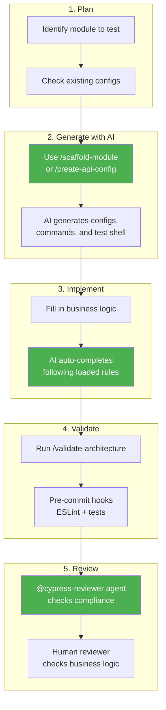

### Workflow: New Module

1. **Scaffold** — `/scaffold-module` generates all five artifacts (API config, UI config, routes entry, commands, spec)
2. **Customize** — Fill in actual endpoint paths and selector values
3. **Auto-complete** — As you type command bodies, AI suggests code that uses your configs
4. **Validate** — `/validate-architecture` checks everything before you open a PR
5. **Review** — `@cypress-reviewer` agent audits the PR for anti-patterns

### Workflow: Debug a Failure

1. **Report** — paste the error message to `@cypress-bug-hunter`
2. **Trace** — AI follows Test → Command → Config path automatically
3. **Diagnose** — identifies the broken layer with common root causes
4. **Fix** — proposes minimal, targeted fix (doesn't refactor unrelated code)

### Workflow: Migrate Legacy Test

1. **Load** — open the legacy file, invoke `/migrate-test-file`
2. **Extract** — AI identifies page object imports, action file references, hardcoded selectors
3. **Convert** — generates new config files, command registrations, and a thin test
4. **Verify** — `/validate-architecture` confirms the migration is clean

---

## 8. Prompting Techniques That Actually Work

We documented 6 core prompting techniques and trained the entire team on them. These aren't theoretical — they're what we use daily.

### The 6 Techniques

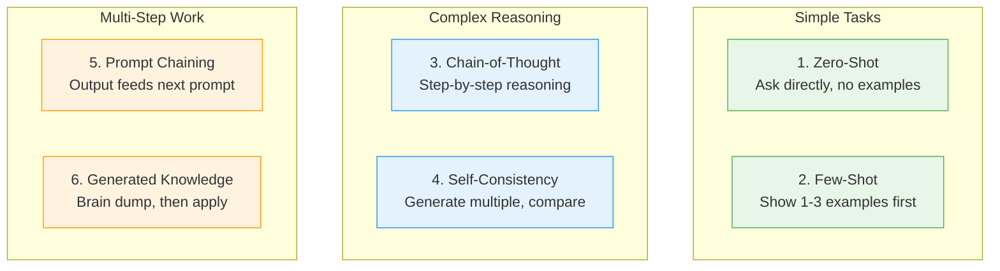

| Technique               | When to Use                            | Example                                                        |
| ----------------------- | -------------------------------------- | -------------------------------------------------------------- |
| **Zero-Shot**           | Quick questions, simple generation     | "What does `cy.ensureAuthenticated()` do?"                     |
| **Few-Shot**            | New configs matching existing patterns | "Here are two UI configs. Generate one for invoices."          |
| **Chain-of-Thought**    | Debugging, architecture review         | "Walk through why this intercept might be missing..."          |
| **Self-Consistency**    | Uncertain about approach               | "Generate this two ways, compare which fits our pattern."      |
| **Prompt Chaining**     | Scaffolding full modules               | `/scaffold-module` chains: API → UI → routes → commands → test |
| **Generated Knowledge** | Unfamiliar area                        | "List what you know about cy.session(), then apply it here."   |

### Good vs. Bad Prompts

| Principle       | ❌ Bad          | ✅ Good                                                                 |
| --------------- | --------------- | ----------------------------------------------------------------------- |
| **Scope**       | "Fix this"      | "Fix the intercept in visitPayments — it's registering after cy.visit"  |
| **Reference**   | "Make a config" | "Make a config using `createModuleConfig` like the example API config"  |
| **Output**      | "Help me"       | "Generate only the command file; I already have the API and UI configs" |
| **Constraints** | _(none)_        | "No cy.wait(number), use [data-cy] selectors, follow command-first"     |

The key insight: **specific context produces specific output.** The more you tell AI about what you have and what you need, the less it guesses wrong.

---

## 9. Impact — What Changed After AI Integration

### The Transformation

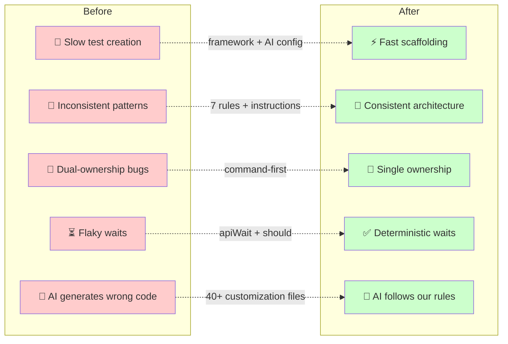

### Measurable Outcomes

| Metric                          | Before                                  | After                                              |
| ------------------------------- | --------------------------------------- | -------------------------------------------------- |
| New module scaffolding          | Manual, 30+ min                         | 1 prompt, ~2 min                                   |
| Architectural violations in PRs | Common (caught in review or not at all) | Near-zero (caught by auto-injected instructions)   |
| Page objects in new work        | Default pattern                         | **Zero** — AI stops you before you start           |
| `cy.wait(ms)` in new work       | Common                                  | **Zero** — AI suggests `apiWait` or `.should()`    |
| Onboarding a new team member    | Days to learn patterns                  | Read prompting guide, start generating immediately |
| API contract tests              | Manual, ad-hoc                          | Systematic: 48+ endpoints validated                |
| Test consistency                | Varies by author                        | Uniform — same patterns regardless of who wrote it |

### Redundancy Elimination

The architecture + AI combination acts as a **duplication police**:

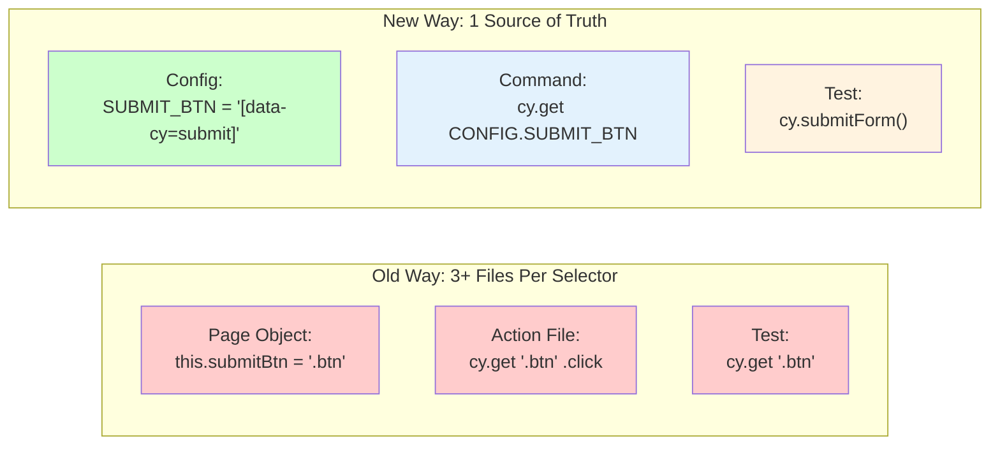

When a selector changes: **update one config file.** Everything downstream — commands, tests, AI-generated code — automatically uses the new value.

### The Factory Pattern

Instead of manually defining 50+ lines of endpoint objects per module, a factory function generates them from compact definitions:

```js
// ~10 lines produces 6+ typed intercept entries
export const PAYMENTS_CONFIG = createModuleConfig({
  basePath: "/api/v1/payments",
  prefix: "PAYMENT",
  resources: ["LIST", "DETAILS", "CREATE", "UPDATE", "DELETE"],
});
// Auto-generates: @PAYMENT_LIST, @PAYMENT_DETAILS, @PAYMENT_CREATE, etc.
```

AI understands this factory — when you ask for a new API config, it generates the compact definition, not the expanded boilerplate.

---

## 10. Patterns That Scale

### API-First: Intercepts Before Visit

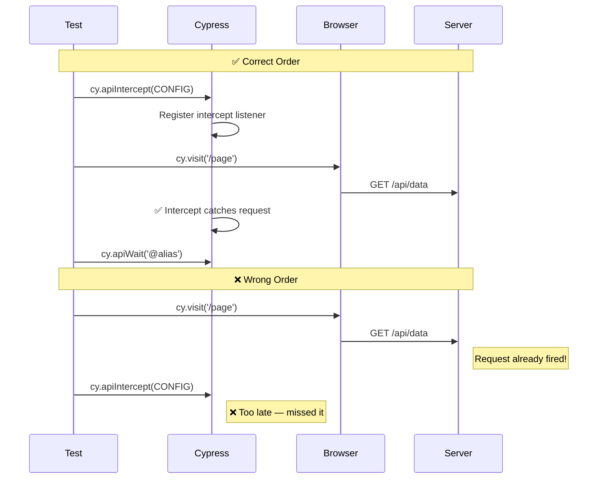

### Atomic Commands — One Command, One Action

Each command does exactly one thing. Tests compose them:

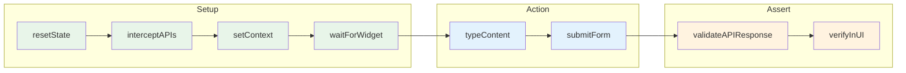

### Scenario-Driven Testing

Complex workflows use scenario config objects — data-driven testing where the test logic is written once and the scenarios define the variations:

```js
// Scenario config — pure data
export const SCENARIOS = Object.freeze({
  HAPPY_PATH: {
    steps: [
      { question: "Q1", answer: "yes" },
      { question: "Q2", answer: "yes" },
    ],
    expectedOutcome: "SUCCESS_STATE",
  },
  ERROR_PATH: {
    steps: [{ question: "Q1", answer: "no" }],
    expectedOutcome: "ERROR_STATE",
  },
});

// Test — logic written once
cy.executeScenario("HAPPY_PATH");
cy.assertScenarioOutcome("HAPPY_PATH");
```

**10+ scenario paths, zero duplicated test logic.**

### Phase-Based API Testing

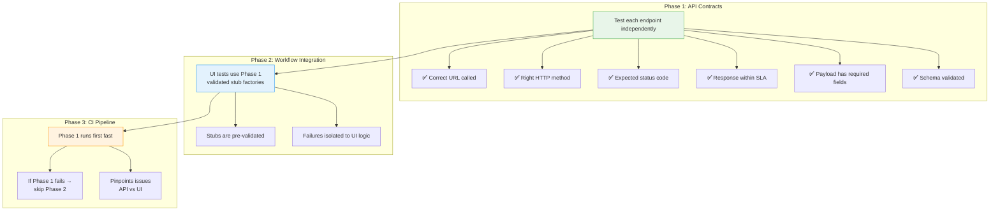

If Phase 1 fails → fix the API layer. If Phase 2 fails → fix the UI layer. The separation makes debugging twice as fast.

---

## 11. Lessons Learned — The Hard Way

### 1. AI Is Only as Good as Your Rules

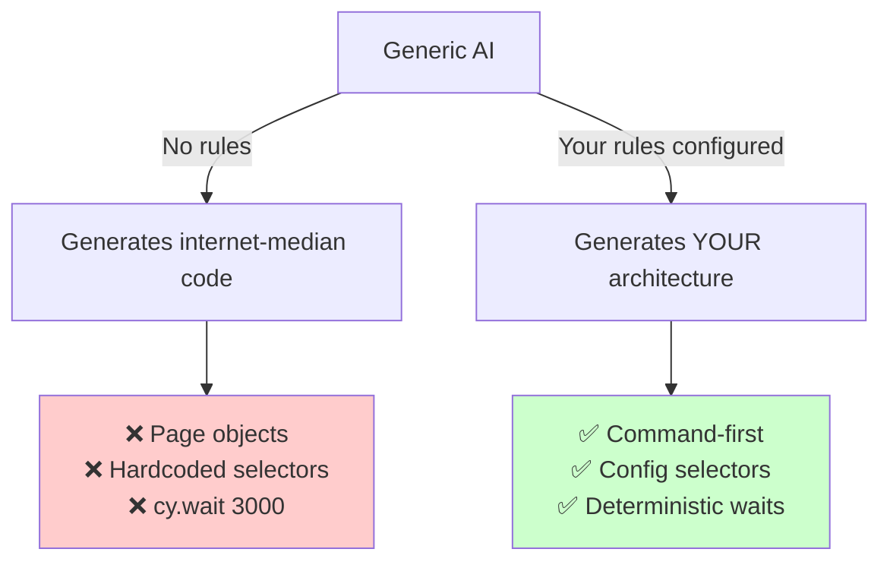

The investment in writing `copilot-instructions.md` paid back within the first day. Every minute spent on customization files saves hours of fixing AI-generated anti-patterns.

### 2. Instructions > Prompts for Consistency

Auto-injected instructions (triggered by file type) produce more consistent output than manually-invoked prompts. Why? Because humans forget to invoke prompts, but **instructions are always there.**

| Approach                             | Reliability | Effort         |
| ------------------------------------ | ----------- | -------------- |
| Hoping developers remember the rules | 🔴 Low      | Zero           |
| Documentation they should read       | 🟡 Medium   | Low            |
| Prompts they should invoke           | 🟡 Medium   | Medium         |
| **Auto-injected instructions**       | 🟢 **High** | **Write once** |

### 3. Skills Package Knowledge That Compounds

When I encoded my migration methodology into a skill, I captured months of hard-won experience. Now any engineer who joins — even on day one — can migrate a legacy test and get the same quality output that I produce after years on the codebase.

**Knowledge doesn't leave when people leave. It lives in skill files.**

The skills file _becomes_ team knowledge — persistent, queryable, and accessible to every engineer, regardless of how long they've been on the project.

### 4. The Architecture That's Good for Humans Is Good for AI

This was the biggest surprise: **every decision we made for code maintainability also made AI more effective.**

| Decision (for humans)                | Why it helps AI                                |
| ------------------------------------ | ---------------------------------------------- |
| Single source of truth for selectors | AI reads one file, generates correct selectors |
| Verb-first command naming            | AI infers intent from method name              |
| Frozen config objects                | AI knows values won't change at runtime        |
| Thin test files                      | AI generates less code with fewer mistakes     |
| Consistent file naming               | AI predicts file locations reliably            |

### 5. Pre-Commit Hooks Are the Safety Net

`husky` + `lint-staged` + `eslint` ensure that AI-generated code passes the same quality gates as human code. No exceptions, no shortcuts.

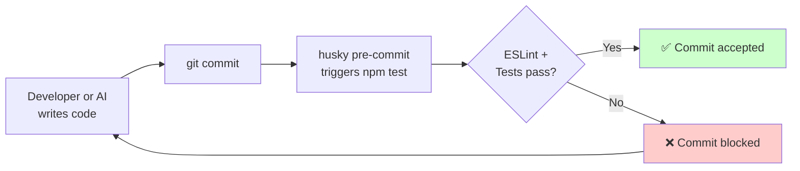

### 6. Documentation Written WITH AI Stays Accurate

We maintain our framework docs using the documentation-writer agent, which cross-references the actual codebase. Traditional docs rot. **AI-maintained docs evolve with the code.**

### 7. The Prompting Guide Teaches Humans, Not Just AI

Writing the prompting guide forced us to articulate HOW to think about AI interactions. New team members read it and immediately become productive — not because they memorized prompts, but because they learned the **principles** behind effective AI collaboration.

### 8. Start with the Boilerplate, Customize for Production

I extracted my patterns into a reusable boilerplate that any team can fork. The boilerplate proves the architecture works generically; the production implementation proves it works at scale. Both share Copilot customizations, so AI works identically in both.

### 9. Build for the Team You Don't Have Yet

This was the organizing principle that shaped everything else: refuse to build a system only its author can navigate.

Every decision starts with one question: **"If a developer joins tomorrow and has never seen this codebase, can they contribute safely within a day?"**

Here's what that question forced me to create:

| Question                                                 | Answer I Forced Myself to Build                                 |
| -------------------------------------------------------- | --------------------------------------------------------------- |
| "How will they know what pattern to follow?"             | `copilot-instructions.md` — AI enforces it automatically        |
| "How will they know what commands exist?"                | Docs + verb-first naming that reads like plain English          |
| "How will they not accidentally run legacy patterns?"    | Auto-injected instructions block anti-patterns per file type    |
| "How will they debug a failure they didn't write?"       | The bug-hunter agent follows a structured trace they can invoke |
| "How will they write a new module without asking me?"    | The scaffold agent generates all 5 artifacts from one prompt    |
| "How do I protect the architecture without being there?" | Pre-commit hooks reject non-compliant code at the git level     |

The compound effect: **designing for a team improves the experience for every engineer working in it today.** Every abstraction that helps a future teammate also reduces cognitive load for the engineers already there. The framework becomes strong enough to survive any individual — and in doing so, it frees everyone.

---

## 12. Getting Started — For Teams Who Want to Try This

### The Adoption Roadmap

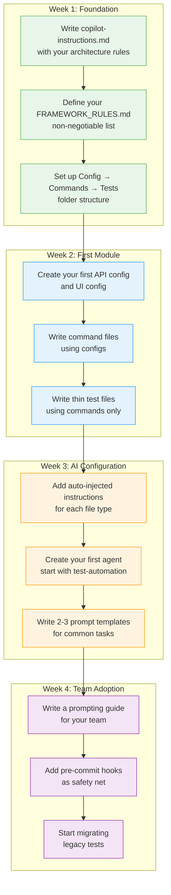

### Quick Wins (Do These First)

1. **Write `copilot-instructions.md`** — even 10 lines of architectural rules will dramatically improve AI output
2. **Add one auto-injected instruction file** — for your most common file type (test files)
3. **Create one agent** — the test automation agent that enforces your patterns
4. **Set up pre-commit hooks** — so AI-generated code gets the same quality gate as human code

### The Investment-to-Impact Curve

| Investment                           | Time to Write  | Impact                                            |
| ------------------------------------ | :------------: | ------------------------------------------------- |
| `copilot-instructions.md`            |   30 minutes   | 🟢🟢🟢🟢🟢 Highest — transforms every interaction |
| Auto-injected instructions (3 files) |   1-2 hours    | 🟢🟢🟢🟢 High — silent enforcement                |
| First 2-3 agents                     |   2-3 hours    | 🟢🟢🟢 Medium-high — task specialization          |
| Prompt templates                     |   1-2 hours    | 🟢🟢 Medium — speeds up common tasks              |
| Skills                               | 2-4 hours each | 🟢🟢🟢 Medium-high — compounds over time          |
| Prompting guide                      |    Half day    | 🟢🟢🟢🟢 High — multiplies team effectiveness     |

### Summary: The Configuration Ecosystem

| Customization Type         | Count | Purpose                                                       |
| -------------------------- | :---: | ------------------------------------------------------------- |
| Global instructions        |   2   | Always-on architecture rules and operating playbook           |
| Specialized agents         |   8   | Task-specific AI modes (test, review, debug, perf, docs, QA)  |
| Auto-injected instructions |   3   | File-type-specific rules (commands, configs, tests)           |
| Prompt templates           |  6+   | Slash-command shortcuts for common generation tasks           |
| Domain skills              |   5   | Packaged expertise (migration, review, debug, perf, API docs) |
| Chat modes                 |   2   | Conversational workflow contexts (QA, documentation)          |
| Pre-commit quality gates   |  ✅   | ESLint + tests on every commit                                |

---

## Final Thoughts

Building a test automation framework that scales is hard. Integrating AI into that framework in a way that actually helps — rather than generating noise — is harder. What we learned is this:

> **The same architecture that makes code maintainable for humans also makes it effective for AI.**

When every selector has one home, every behavior has one owner, and every rule is written down in a file that AI reads automatically — the result is a system where humans define the intent and AI executes the patterns. Consistently. Every time.

The 40+ Copilot customization files aren't overhead. **They're a one-time investment that pays compound interest on every interaction** — every test faster to write, every bug faster to find, every team member faster to onboard.

The future of test automation isn't humans OR AI. It's **humans configuring AI to follow proven patterns — and AI executing those patterns at scale.**

---

**Tags**: `#cypress` `#test-automation` `#github-copilot` `#ai-powered-testing` `#command-first` `#qa-engineering` `#framework-design`
