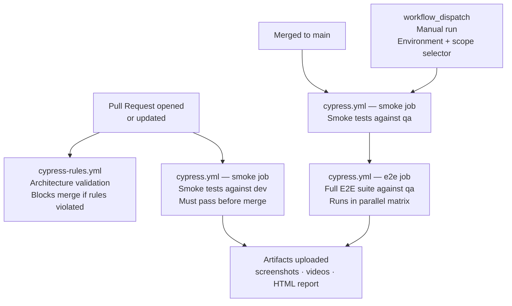

# CI/CD Guide

> **This is an operations doc.** It covers how the pipelines work, how to configure them, how to read results, and how to adapt from GitHub Actions to AWS CodeBuild.

---

## Pipeline Overview

Two workflows run in parallel on every PR:

| Workflow | File | What it checks | Blocks merge? |
| -------- | ---- | -------------- | ------------- |
| Architecture Rules | `cypress-rules.yml` | Non-negotiable framework rules | Yes — BLOCK verdict |
| Cypress Tests | `cypress.yml` — smoke job | Smoke suite against dev | Yes — tests must pass |

On merge to main, the full E2E suite runs automatically.

---

## Required GitHub Secrets

Set these in **Repository Settings → Secrets and variables → Actions**:

| Secret name | What it is |
| ----------- | ---------- |
| `BASE_URL` | Target app URL for the environment |
| `CYPRESS_USERNAME` | Test user login |
| `CYPRESS_PASSWORD` | Test user password |
| `CYPRESS_AUTH_URL` | Auth endpoint (e.g. `/api/auth/login`) |
| `CYPRESS_RECORD_KEY` | Cypress Cloud record key (optional — enables recording) |

Create one set of secrets per environment using **GitHub Environments** (Settings → Environments):

- `dev` environment → dev secrets
- `qa` environment → qa secrets
- `prod` environment → prod secrets (read-only, smoke only)

> Never put credentials directly in workflow files. Always use `${{ secrets.NAME }}`.

---

## Running Tests Manually

Use the **workflow_dispatch** trigger for manual runs:

1. Go to **Actions → Cypress Tests → Run workflow**
2. Select environment: `dev`, `qa`, or `prod`
3. Select scope: `smoke`, `e2e`, or `all`
4. Click **Run workflow**

Prod environment only runs smoke — the E2E job is skipped automatically.

---

## Reading Test Results

### Artifacts
Every run uploads artifacts (pass or fail). Find them in **Actions → [run] → Artifacts**:

| Artifact | Contains | Retention |
|----------|----------|-----------|
| `smoke-report-{id}` | Mochawesome HTML report | 14 days |
| `smoke-failure-artifacts-{id}` | Screenshots + videos | 7 days (failure only) |
| `e2e-smoke-report-{id}` | Mochawesome HTML for smoke module | 14 days |
| `e2e-e2e-report-{id}` | Mochawesome HTML for e2e module | 14 days |

### Reading a Mochawesome report
Download the artifact, open `reports/index.html` in a browser. Failed tests show the error, the command that failed, and a screenshot if one was captured.

### Cypress Cloud (optional)
If `CYPRESS_RECORD_KEY` is set, results are also recorded to Cypress Cloud for:
- Test replay with time-travel debugging
- Flakiness detection across runs
- Parallel run coordination

---

## Environment → Branch Mapping

| Branch / trigger | Environment | Scope |
| ---------------- | ----------- | ----- |
| Any PR | `dev` | Smoke |
| Push to `main` | `qa` | Smoke + E2E |
| Manual `prod` | `prod` | Smoke only |
| Manual `dev` | `dev` | Selectable |
| Manual `qa` | `qa` | Selectable |

---

## Adding a New Environment

1. Create the environment config: `cypress/config/cypress.env.[name].json`
2. Add a GitHub Environment: Settings → Environments → New environment
3. Add secrets to the new environment
4. Add the environment name to the `workflow_dispatch` options in `cypress.yml`

---

## Debugging a CI-Only Failure

Tests can fail in CI and pass locally due to:

| Cause | How to diagnose |
| ----- | --------------- |
| Wrong environment URL | Check `BASE_URL` secret matches the target env |
| Missing secret | Check the workflow log for `undefined` or empty values in `cypress.env.json` |
| Timing on slow CI | Check if `cy.apiWait()` is used — CI machines are slower than local |
| Auth failure | Check `CYPRESS_AUTH_URL` and credential secrets are set for the correct environment |
| Intercept fired before registration | Check command order: `cy.apiIntercept()` must be before `cy.visit()` |

Steps:
1. Download the failure artifact — watch the video for visual context
2. Check the screenshot for the exact DOM state at failure
3. Run the spec locally against the same environment: `npm run cy:run -- --env configFile=qa --spec "path/to/spec"`
4. Use the `cypress-bug-hunter` agent with the error message and recent changes

---

## Adapting to AWS CodeBuild

The GitHub Actions setup above covers most teams. If your infrastructure is AWS-based, the FHF reference project has a production-grade `buildspec.yml` with:

- Branch → environment mapping (`dev`/`qa`/`staging`/`main` → `dev`/`qa`/`prod`)
- AWS Secrets Manager credential loading (no GitHub Secrets needed)
- Parallel Cypress Cloud execution with configurable worker count per instance size
- JUnit XML merging across parallel workers before TestRail upload
- TestRail integration via `trcli`
- Mochawesome report merging across parallel workers
- Email notification via `sendMail.js`

Key differences from the GitHub Actions setup:

| Concern | GitHub Actions | AWS CodeBuild (FHF pattern) |
| ------- | -------------- | --------------------------- |
| Secrets | GitHub Secrets per environment | AWS Secrets Manager (`{env}/front-end-automation`) |
| Parallelism | Matrix strategy (separate runners) | Single instance, N worker processes via `run-parallel.sh` |
| Test results | HTML report artifact | TestRail upload + Mochawesome merge |
| Notifications | GitHub PR status | Email via `sendMail.js` |
| Trigger | GitHub webhook | CodeBuild webhook or manual |

To use the CodeBuild pattern: copy `buildspec.yml` from the FHF project and adapt the `PROJECT_DIR` and `SECRET_ID` values to your repo structure.

---

## Architecture Validation in CI

The `cypress-rules.yml` workflow runs `validate-cypress-rules.mjs` — the same script that runs locally via the `.claude/hooks/` pre-write hook.

If the hook blocks locally (e.g. you wrote `cy.wait(2000)`), the CI check will also block. You cannot bypass it with `--no-verify`.

What it checks (same as the local hook):
- No `cy.wait(number)` in any Cypress file
- No hardcoded selectors in tests or commands
- No hardcoded URLs in tests or commands
- No new `*.actions.js` files
- No new page-object wrapper files

If CI blocks on this check, fix the violation and push again. Do not disable the workflow.
