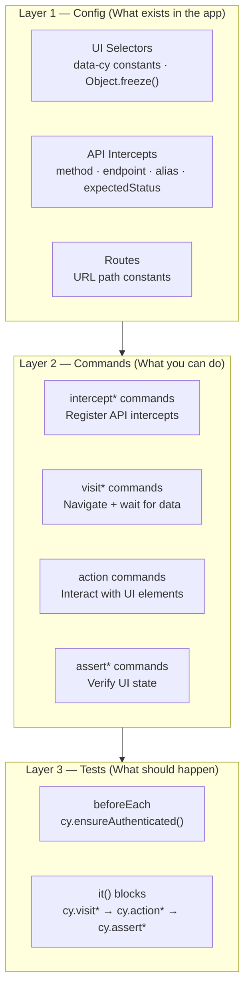

# Framework Standards

> **This is an explanation doc.** It answers *why* the architecture is designed the way it is — not just what the rules are. Read this once. Refer back when a rule feels arbitrary.

---

## Why This Architecture Exists

Test automation fails in predictable ways:

- **Selectors break** when UI is refactored — because they were hardcoded in 50 test files
- **Tests become unreadable** — because each spec contains navigation, setup, interaction, and assertion all mixed together
- **Changes cascade** — updating a login flow means touching every test that logs in
- **Duplication explodes** — the same `cy.get('.submit-btn').click()` appears in 30 specs

The Config → Commands → Tests architecture solves all four:

- Selectors live in one place (Config). Change one constant, every test updates.
- Tests are thin orchestration (Tests). They read like plain English because Commands own all complexity.
- Shared flows live in commands (Commands). Change `cy.loginAs()` once, 50 tests are fixed.
- Duplication is structurally prevented — configs are the single source of truth.

---

## The 3-Layer Architecture



**Layer 1 — Config** answers "what exists in the app": selector names, API routes, URL paths. Pure data only. No functions, no logic, no imports except HTTP status constants.

**Layer 2 — Commands** answers "what can you do": atomic, reusable `cy.*` operations. Every command owns a single responsibility and imports from Layer 1 only. No hardcoded values.

**Layer 3 — Tests** answers "what should happen": a sequence of `cy.*` calls that describe a user journey. No selectors, no URLs, no logic. If a spec has an `if` statement, something is wrong.

---

## Non-Negotiable Rules

| # | Rule | Why it exists |
| - | ---- | ------------- |
| 1 | No page objects, no `*.actions.js` files | Dual ownership causes drift — two places describe the same thing and they diverge. Commands own all logic with explicit, single ownership. |
| 2 | No `cy.wait(number)` | Hard waits are lies. They mask timing problems instead of solving them. Use `cy.apiWait('@alias')` or `.should('be.visible')` — both wait for the actual condition. |
| 3 | `[data-cy="..."]` selectors only | CSS classes and IDs change with every refactor. `data-cy` attributes are test-only contracts — stable, explicit, and decoupled from styling. |
| 4 | Auth via `cy.ensureAuthenticated()` only | Wraps `cy.session()` caching. Without it, every test performs a full login. With it, the session is reused across tests in the same spec — orders of magnitude faster. |
| 5 | Intercepts registered before `cy.visit()` | Network requests fire the moment the page loads. If you register an intercept after `cy.visit()`, the request has already passed and Cypress never sees it. |
| 6 | State reset in `beforeEach`, not `afterEach` | `afterEach` does not run when a test fails. State left behind by a failed test contaminates the next one. `beforeEach` always runs — it is the only reliable reset point. |
| 7 | All URL paths from `ROUTES` constants | A hardcoded `/payments` in a test breaks silently when the route changes to `/finance/payments`. Constants fail loudly at import time. |

---

## Folder and File Naming

Every module uses the same name across all layers. One name, four files.

```text
cypress/configs/api/modules/payments/payments.api.js
cypress/configs/ui/modules/payments/payments.ui.js
cypress/support/commands/modules/payments.commands.js
cypress/tests/payments/smoke/payments-smoke.cy.js
```

| Layer | File pattern | Example |
| ----- | ------------ | ------- |
| API config | `[name].api.js` | `payments.api.js` |
| UI config | `[name].ui.js` | `payments.ui.js` |
| Commands | `[name].commands.js` | `payments.commands.js` |
| Smoke spec | `[name]-smoke.cy.js` | `payments-smoke.cy.js` |
| E2E spec | `[name]-e2e.cy.js` | `payments-e2e.cy.js` |
| Schema | `[name].schema.js` | `payments.schema.js` |
| Fixture | `[name].json` | `payments.json` |

Folder names: **kebab-case**. No camelCase, no underscores.

---

## Selector Strategy

| Score | Strategy | Example | When to use |
| ----- | --------- | ------- | ----------- |
| 10/10 | `data-cy` attribute | `[data-cy="submit-btn"]` | Always — add to the app if missing |
| 3/10 | CSS class | `.btn-primary` | Never in new code |
| 2/10 | Tag + text | `button:contains("Save")` | Never in new code |
| 1/10 | XPath | `//button[@id="save"]` | Never |

**Only 10/10 is acceptable.** If a `data-cy` attribute does not exist, coordinate with the development team to add it. Do not write a test that depends on a CSS class.

Raise a PR comment for any selector below 10/10. Do not merge it.

---

## Tagging Strategy

Tags control which tests run in which CI pipeline. Apply them consistently.

```javascript
describe("Payments", { tags: ["@payments"] }, () => {
  it("loads the list", { tags: ["@smoke"] }, () => { /* ... */ });
  it("validates pagination", { tags: ["@e2e"] }, () => { /* ... */ });
  it("handles empty state", { tags: ["@e2e"] }, () => { /* ... */ });
});
```

| Tag | Meaning | When it runs |
| --- | ------- | ------------ |
| `@smoke` | Critical path, fast | Every commit, every PR |
| `@e2e` | Full flow, slower | Nightly, pre-release |
| `@[module]` | Module-specific | When that module changes |

Run a subset locally:

```bash
npx cypress run --env grepTags=@smoke
npx cypress run --env grepTags=@payments
```

---

## Why No Page Objects?

Page objects were invented to solve the selector duplication problem. This framework solves it better with the Config layer.

Page objects have a structural weakness: they mix two responsibilities — storing selectors (data) and exposing methods (behaviour). Methods accumulate test logic that belongs in commands. Two teams often create overlapping page objects for the same feature. There is no enforcement of ownership.

Commands are explicit: one command, one owner, registered in `commands.js`. The Config layer stores selectors. The separation is enforced by the directory structure, not by convention.

---

## Why No `cy.wait(number)`?

```javascript
// This test passes locally and fails in CI at random
cy.click(PAYMENTS_UI.FORM.SUBMIT_BTN);
cy.wait(2000);
cy.get(PAYMENTS_UI.LIST.TABLE).should("be.visible");

// This test passes everywhere, always
cy.click(PAYMENTS_UI.FORM.SUBMIT_BTN);
cy.apiWait("@paymentCreate");
cy.get(PAYMENTS_UI.LIST.TABLE).should("be.visible");
```

The `cy.wait(2000)` version guesses how long the API call takes. That guess is wrong on a slow CI machine. The `cy.apiWait()` version waits for the actual network response — the test proceeds exactly when the data is there, no sooner, no later.
