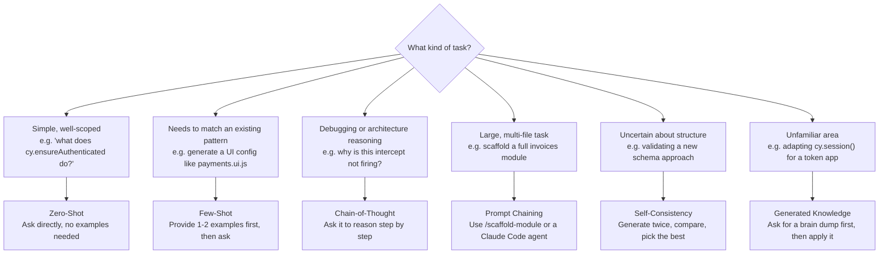

# AI Prompting Guide

> **This is a how-to doc.** It shows you how to get the best results from Claude Code and GitHub Copilot in this framework — which technique to use, when, and what a good prompt looks like versus a bad one.

---

## Claude Code vs GitHub Copilot

Both AI tools are wired into this framework. They serve different purposes.

| Tool | Best for | How to invoke |
| ---- | -------- | ------------- |
| **Claude Code** | Multi-step tasks, debugging, architecture decisions, writing docs | Agents (`cypress-test-automation`, etc.) and Skills (`/detect-duplication`, etc.) |
| **GitHub Copilot** | Code completion, generating a single file, quick Q&A in chat | `@agent-name` in Copilot Chat, or inline completions |

When a task spans multiple files or requires reasoning about the framework (e.g. "write a full module for invoices"), use a **Claude Code agent**. When you need a single file generated or a quick question answered, Copilot Chat is faster.

---

## Choosing a Prompting Technique



---

## The 6 Techniques

### 1. Zero-Shot

Ask directly. No examples, no setup. Works when the task is simple and well-scoped.

```text
What does cy.ensureAuthenticated() do in this framework?
```

```text
What is the difference between cy.apiIntercept() and cy.apiStub()?
```

---

### 2. Few-Shot

Provide 1–2 examples of what you want before making the request. The AI infers the pattern and matches it exactly.

Use this when generating configs or commands that must follow the framework's exact shape.

```text
Here are two existing UI configs:

// payments.ui.js
export const PAYMENTS_UI = Object.freeze({
  LIST: { TABLE: '[data-cy="payments-table"]' }
});

// users.ui.js
export const USERS_UI = Object.freeze({
  LIST: { TABLE: '[data-cy="users-table"]' }
});

Now generate a UI config for the "invoices" module using the same pattern.
Selectors needed: table, search input, create button, empty state.
```

---

### 3. Chain-of-Thought

Ask the AI to reason through the problem step by step before writing anything. Use this for debugging, architecture decisions, and failure analysis.

```text
A test is failing with "cy.apiWait('@paymentsList') timed out".
Walk through each of these possible causes:
1. Is the intercept registered before cy.visit()?
2. Does the alias in the API config match the string passed to cy.apiWait()?
3. Does the endpoint glob pattern match the actual request URL?
Diagnose the most likely cause and suggest a fix.
```

---

### 4. Prompt Chaining

Break a large task into a sequence — the output of each step feeds the next. Use Claude Code agents for this — they handle the chain automatically.

```text
cypress-test-automation agent:

Scaffold a full module for "invoices".
- Base API path: /api/v1/invoices
- Endpoints needed: LIST (GET), DETAILS (GET), CREATE (POST), VOID (POST /invoices/:id/void)
- UI views: list table with search, create form
- Coverage: smoke tests only
```

The agent will generate API config → UI config → routes → commands → spec in order, following the framework pattern.

---

### 5. Self-Consistency

Generate the same artifact two different ways, then compare and pick the most consistent result. Use when you are uncertain whether a pattern is correct.

```text
Generate the API config for an invoices module two ways:
- Once using individual Object.freeze() entries (like the saucedemo example)
- Once using a flat structure without nested freezing

Which approach matches the framework standard in CLAUDE.md and why?
```

---

### 6. Generated Knowledge

Ask for a knowledge dump on a topic first, then use that knowledge to complete the task. Use when working in an unfamiliar area of Cypress or the framework.

```text
List everything you know about cy.session() in Cypress 13:
how it works, what cacheAcrossSpecs does, when validate() is called,
and what happens when the session is invalidated.

Then use that knowledge to update cy.ensureAuthenticated() to handle
a token-based app that stores auth in localStorage instead of cookies.
```

---

## What Makes a Good Prompt

| Principle | Bad | Good |
| --------- | --- | ---- |
| **Scope** | "Fix this" | "The intercept in `visitPayments` fires after `cy.visit()` — move it before" |
| **Reference files** | "Make a config" | "Make a config following the shape in `saucedemo.api.js`" |
| **Desired output** | "Help me" | "Generate only the command file — I already have the API and UI configs" |
| **Constraints** | _(none stated)_ | "No `cy.wait(number)`, use `[data-cy]` selectors, command-first pattern only" |
| **Context** | "It's broken" | "Test: `payments-smoke.cy.js`, error: `element not found [data-cy='payments-table']`, recent change: added auth redirect" |

The framework rules (no `cy.wait(number)`, `[data-cy]` selectors only, no page objects) are enforced automatically by `.claude/hooks/` — you do not need to repeat them in every prompt. They are always on.

---

## Ready-to-Use Prompt Templates

### Scaffold a full module

```text
cypress-test-automation agent:

Module name: [name]
API base path: [/api/v1/name]
Endpoints: [LIST GET, DETAILS GET, CREATE POST — plus any custom]
UI views: [list table | form | detail view]
Coverage: [smoke | e2e | both]
```

### Debug a failing test

```text
/cypress-debug-playbook

Failing spec: [file path and it() description]
Error message: [paste exact error]
Recent changes: [what changed before this started failing]
```

### Validate architecture before PR

```text
/cypress-architecture-review

Files to check:
[paste file paths or contents]
```

### Convert a Jira ticket

```text
/jira-to-cypress

Ticket: [AC text or paste the acceptance criteria]
Module: [which module this belongs to]
```

---

## How Claude Code Agents Work in This Repo

Each agent is defined in `.claude/agents/` and has a specific role. Invoke via the agent name in Claude Code:

| Agent | Role |
| ----- | ---- |
| `cypress-test-automation` | Writes new tests, commands, and full modules |
| `cypress-cloud-investigator` | Investigates Cypress Cloud CI failures |
| `cypress-bug-hunter` | Debugs a failing test with root-cause analysis |
| `cypress-reviewer` | Pre-merge code review |
| `cypress-performance-auditor` | Flakiness and slowness audit |
| `pre-merge-qa-gate` | Full 6-phase QA gate |
| `documentation-writer` | Writes or updates framework docs |
| `pr-creator` | Opens a PR with a generated description |

## How GitHub Copilot Agents Work in This Repo

Each agent is defined in `.github/agents/` and invoked with `@agent-name` in Copilot Chat:

| Agent | Role |
| ----- | ---- |
| `@cypress-test-automation` | Writing new tests or commands |
| `@cypress-reviewer` | Pre-merge architecture check |
| `@cypress-bug-hunter` | Root cause analysis |
| `@cypress-performance-auditor` | CI time and flakiness audit |
| `@documentation-writer` | Writing or updating framework docs |
| `@pre-merge-qa-gate` | Full QA gate |

The `.github/copilot-instructions.md` file applies framework rules (no page objects, no `cy.wait(number)`, `[data-cy]` selectors only) to every Copilot response automatically. You do not need to restate them.
